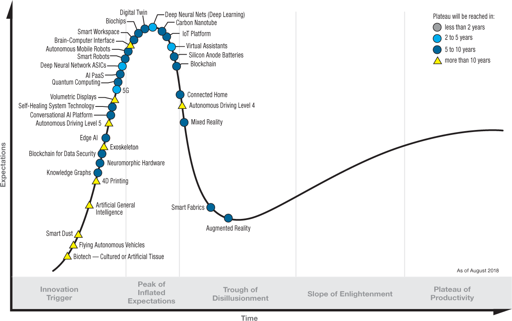
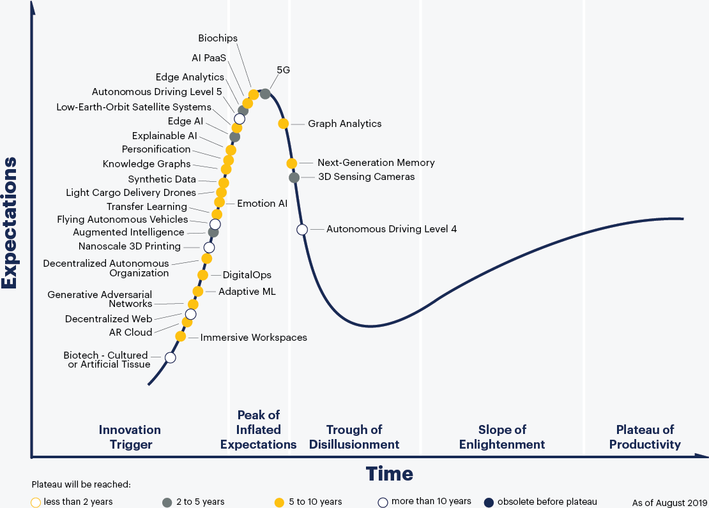
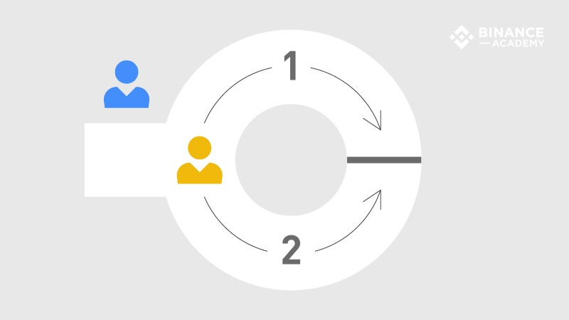
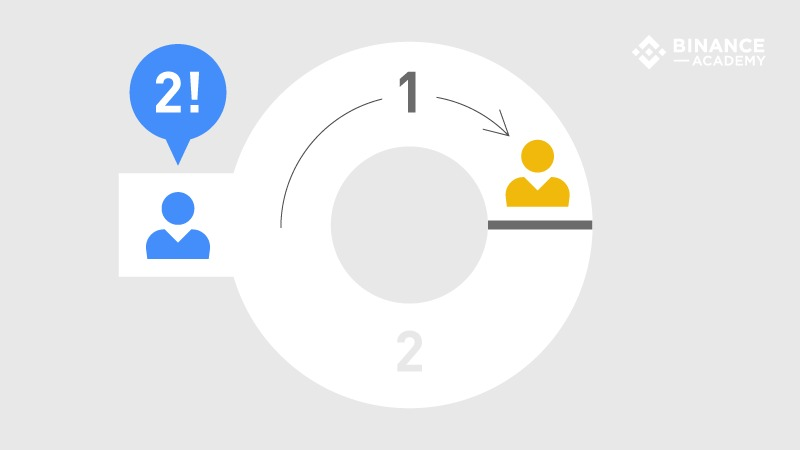
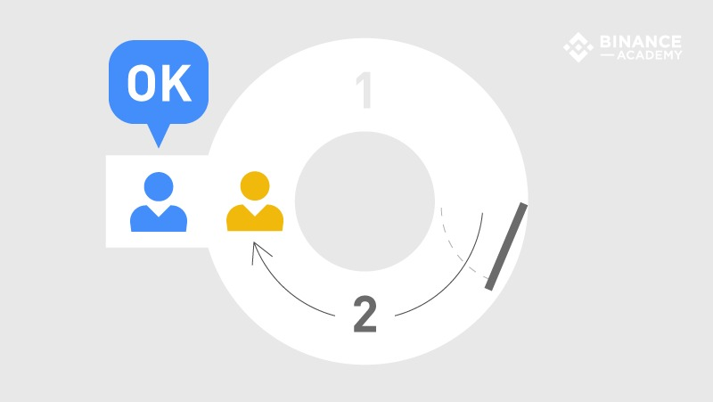

title: Tecnologies disruptives
class: animation-fade
layout: true

<!-- This slide will serve as the base layout for all your slides -->
.bottom-bar[
  <strong>{{title}}</strong> | Dario Castañé | @im_dario
]

---

class: impact

# Tecnologies disruptives

## IGD Tech & Drinks - Setembre 2019

---

# Dario Castañé

- Enginyer informàtic: Engisoft Cloud Services
- Pirates de Catalunya
- Blockchain Catalunya
- Fundació Inceptum
- Divulgador

---

## Xerrades

- **2014:** Techno Politics
- **2014-...:** Tallers de defensa digital personal
- **2016:** Municipi i tecnologia: On som i futurs possibles
- **2018-...:** IGD Tech & Drinks: Blockchain, contenidors, etc.
- **2019:** Espiadas y vendidas
- **2019:** Estònia estat digital. Realitat o ficció?
- Més a dario.im

---

class: impact

# &lt;/falca&gt;

---

# Què entenem per disruptiu?

- Innovació que genera nous mercats
- Que irromp en els ja establerts
- No necessàriament és radicalment nova: evolució

---

# Exemples

- **Cotxe:** carruatges de tracció animal
- **PC:** màquina d'escriure i formes de comunicació
- **Smartphone:** PDAs, càmares, reproductors, etc.

---

class: impact

# Hype cycle

## O cicle de sobreexpectació

???

- Cicle de sobreexpectació
- Creat per Gartner
- Mesurar i representar maduresa, adopció i aplicació social d'una tecnologia
- Es divideix en cinc fases.
- 1. Llançament: prototips
- 2. Pic d'expectatives sobredimensionades: primera generació
- 3. Abisme de desil·lusió: primera generació massa cara
- 4. Rampa de consolidació: segona generació, maduració
- 5. Altiplà de productivitat: ecosistema (proveïdors i venedors)

---

.center[]

???

- 2018

---

.center[]

???

- 2019

---

class: impact

# zk-SNARKs

---

## Què són?

- Tècnica criptogràfica
- Proves de coneixement zero (Zero Knowledge)
- Permet que algú demostri a altri que quelcom és cert, sense revelar informació

---

background-image: url(zk-snarks-paper.png)

???

- Metàfora de la cova d'Ali Babà

---

.center[]

???

- Alice: taronja
- Bob: blau
- Alice sap les paraules màgiques de la porta per creuar el passadís

---

.center[]

---

.center[]

???

- Exemples: demostrar ser major d'edat

---

## Quina utilitat tenen?

- Identitats sobiranes: IdentiCAT
- Votació electrònica: Vocdoni
- Transaccions econòmiques: Zcash

---

## Per què és disruptiva?

- Desintermediació
- Sobirania de dades personals

---

class: impact

# Deep fakes

---

## Què són?

- Aplicació pràctica del deep learning

???

- Machine learning

---

  <iframe style="position:absolute;top:0;left:0;width:100%;height:100%;" src="https://www.youtube.com/embed/VWrhRBb-1Ig" frameborder="0" allow="encrypted-media" allowfullscreen></iframe>

---

## Per què és disruptiva?

- Impacte social: fake news
- Industria cinematogràfica

???

- Credibilitat
  - Manipulació

---

class: impact

# APM?

---

# Gràcies!

- i@dario.im
- @im_dario
- github.com/imdario
- @dario@mastodon.social
- keybase.io/dario

???

- Pas a la informàtica quàntica
- Alfonso Rubio-Manzanares
- CEO d’Entanglement Partners, empresa consultora especialitzada en tecnologies quàntiques
- President de Barcelonaqbit, think tank que avalua l’impacte social i econòmica de la informació quàntica.
