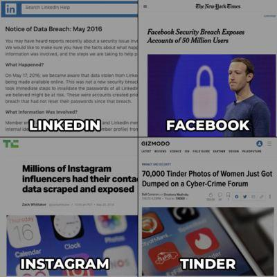
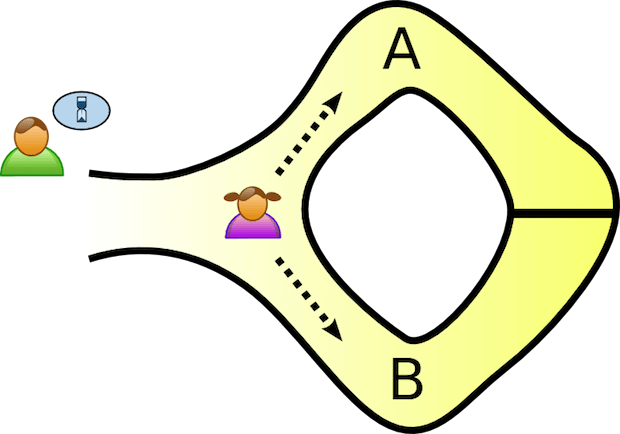

title: Tecnologies disruptives i el seu impacte social
class: animation-fade
layout: true

<!-- This slide will serve as the base layout for all your slides -->
.bottom-bar[
  IGUALADA&nbsp;2020&nbsp;|&nbsp;<strong>{{title}}</strong>&nbsp;|&nbsp;Dario Castañé
]

---

# Dario Castañé

- Enginyer informàtic: Loyal Guru
- Divulgador
- Blockchain Catalunya
- Pirates de Catalunya
- Fundació Inceptum

---

## Xerrades

- **2014:** Techno Politics
- **2014-...:** Tallers d'autodefensa digital
- **2016:** Municipi i tecnologia: On som i futurs possibles
- **2018-...:** IGD Tech & Drinks: Blockchain, contenidors, tecnologies disruptives, etc.
- **2019:** Espiadas y vendidas
- **2019:** Estònia estat digital. Realitat o ficció?
- Més a dario.im

???

- Posarem sobre la taula:
  - Què és la disrupció?
  - Exemples de tecnologies disruptives a l'alça
  - I observarem les seves conseqüències
- Objectiu:
  - Comprendre
  - Detectar
  - No patir de sonambulisme tecnològic (Langdon Winner)

---

# Què entenem per "disruptiu"?

- Innovació que genera nous mercats
- Que irromp en els ja establerts
- Però no necessàriament és radicalment nova

---

## Exemples

- **Cotxe:** carruatges de tracció animal
- **PC:** màquina d'escriure i eines de comunicació
- **Smartphone:** PDAs, càmares, reproductors, etc.

---

class: impact

# Hype cycle

## O cicle de sobreexpectació

???

- Cicle de sobreexpectació
- Creat per Gartner
- Mesurar i representar maduresa, adopció i aplicació social d'una tecnologia
- Es divideix en cinc fases.
- 1. Llançament: prototips
- 2. Pic d'expectatives sobredimensionades: primera generació
- 3. Abisme de desil·lusió: primera generació massa cara
- 4. Rampa de consolidació: segona generació, maduració
- 5. Altiplà de productivitat: ecosistema (proveïdors i venedors)

---

.center[]

???

- 2018

---

.center[]

???

- 2019

---

class: impact

# Disrupcions recents

---

## "Appificació"

- Xarxes socials
- Economia col·laborativa o capitalisme de plataforma?

???

- Aplicacions d'Internet, la gran disrupció

---

.center[]

---

## Deep learning

- Xarxes neuronals artificials especialitzades en:
  - Classificació i predicció
  - Generació
  - Edició o manipulació

---

.center[]

???

- Introduir deep fakes

---

  <iframe style="position:absolute;top:0;left:0;width:100%;height:100%;" src="https://www.youtube.com/embed/VWrhRBb-1Ig" frameborder="0" allow="encrypted-media" allowfullscreen></iframe>

???

- Impacte social: fake news
- Credibilitat
- Industria cinematogràfica

---

## Criptografia aplicada

- Criptomonedes: criptografia de clau assimètrica
- Identitats sobiranes: proves de coneixement zero, zk-SNARK

???

- zk-SNARK: Permet que algú demostri a altri que quelcom és cert, sense revelar informació
- Són disruptives perquè:
  - Desintermediació
  - Sobirania de dades personals

---

### Criptografia asimètrica (molt resumida)

- Clau pública: xifrar
- Clau privada: signar

.right[]

---

### Proves de coneixement zero (també molt resumides)

.center[]

---

class: impact

# I el futur?

---

## Provocatipus

.center[]

---

# Preguntes per a reflexionar

- La tecnologia és neutral?
- La disrupció té només beneficis?
- Controlem la tecnologia o ens controla?
- Cal establir una ètica tecnològica?

???

- Langdon Winner:
  - La tecnologia inclou els nostres biaixos i té intenció
  - Els dissenyadors ho saben bé amb el disseny
- Les IA tenen biaixos: sistemes de reconeixement facil que ignoren asiàtics
- La humanitat no pot entendre's sense la tecnologia, és influència mútua
- Ètica:
  - Dades
  - Desenvolupament de programari

---

# Lectures

- **Evgeny Morozov:** How the Internet strengthens dictatorships - TED Talks
- **Sara Wachter-Boettcher:** Technically Wrong: sexist apps, biased algorithms, and other threats of toxic tech
- **Langdon Winner:** Do artifacts have politics?
- **Judith Duportail:** El algoritmo del amor: Un viaje a las entrañas de Tinder
- **Cennydd Bowles:** Future Ethics

---

class: impact

# APM?

---

# Gràcies!

- d@rio.hn
- twitter.com/@im_dario
- @dario@mastodon.social
- github.com/imdario
- keybase.io/dario
